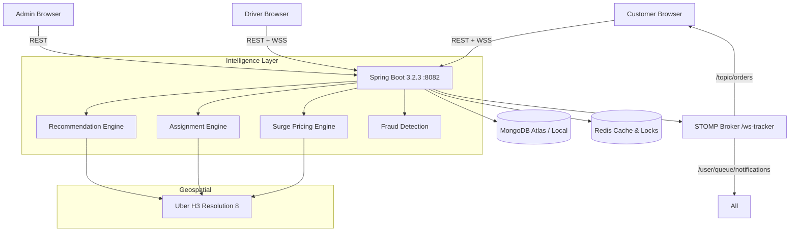

# IntelliFood — Intelligent Food Delivery Platform

> ⚠️ **Status: Work in Progress / Kaam chal raha hai abhi**

A production-grade, full-stack food delivery platform with real-time order tracking, dynamic surge pricing, AI-powered recommendations, fraud detection, and geospatial delivery assignment.

---

## Overview

IntelliFood is a complete three-portal food delivery ecosystem:

- **Customer Portal** — Restaurant discovery, cart, checkout, live order tracking
- **Delivery Partner Portal** — Order acceptance, GPS-tracked delivery, lifecycle management
- **Admin & Operations** — Real-time KPIs, fraud management, surge pricing controls

All portals share a single Spring Boot backend with MongoDB, Redis, WebSocket/STOMP real-time communication, H3 geospatial intelligence, and HMAC-secured pricing.

---

## Architecture



---

## Tech Stack

### Backend

| Component | Technology |
|-----------|------------|
| Framework | Spring Boot 3.2.3 |
| Language | Java 21 |
| Database | MongoDB (Atlas-compatible) |
| Cache | Redis 7+ |
| Auth | JWT (HS512, 24h TTL) |
| Real-time | WebSocket + STOMP (SockJS) |
| Geospatial | Uber H3 Resolution 8 |
| Build | Apache Maven 3.9.6 |
| Container | Docker (Eclipse Temurin 21 Alpine) |
| API Docs | Springdoc OpenAPI / Swagger UI |

### Frontend

| Component | Technology |
|-----------|------------|
| Framework | React 18 |
| Build | Vite |
| Styling | Tailwind CSS |
| State | Zustand + React Query |
| HTTP | Axios |
| Router | React Router v6 |
| Real-time | @stomp/stompjs + SockJS |
| Container | Docker (Nginx Alpine) |

---

## Features

### Customer Portal
- Restaurant discovery with geospatial filtering
- Advanced search (Atlas fuzzy search / regex fallback on local MongoDB)
- Personalised recommendations (affinity scoring + collaborative filtering)
- Dynamic surge pricing with HMAC-signed 120-second quote tokens
- Cart management, checkout, idempotent order placement
- Live order tracking via WebSocket STOMP
- Push-style in-app notifications
- Full order history with status timeline

### Delivery Partner Portal
- Online/Offline availability toggle
- Real-time GPS location broadcast (H3 supply tracking)
- Order accept/reject with timeout logic
- Live delivery status progression (OUT_FOR_DELIVERY → DELIVERED)
- Earnings and delivery history

### Admin & Operations
- Real-time KPI dashboard (orders, revenue, drivers, restaurants)
- Order management with fraud queue
- Fleet management (driver status, location, assignment)
- Dynamic surge pricing: status, H3 overrides, emergency killswitch
- Daily fraud metrics and admin case approval/rejection
- System health: MongoDB, Redis, JVM stats

### Intelligence Layer
- **Surge Pricing Engine**: 4-engine pipeline (Demand → Supply → Calculation → Decision), Redis-backed cache, EMA smoothing, distributed stampede mutex, HMAC tokens, replay attack prevention
- **Recommendation Engine**: Multi-factor scoring (affinity 40%, popularity 20%, collaborative 25%, content 15%), diversity re-ranking with cuisine throttling, 10% exploration slot
- **Assignment Engine**: Geospatial sweep (3km → 5km → 8km), weighted candidate scoring, atomic MongoDB lock, auto-suspend on 3 consecutive rejections
- **Fraud Detection**: Velocity checking, ConcurrentHashMap checkout locking, admin review queue, 500ms SLA enforcement

---

## Backend Modules

| Package | Description |
|---------|-------------|
| `auth` | JWT authentication, registration, BCrypt password encoding |
| `orders` | Order lifecycle, idempotency, fraud check integration, `@Version` optimistic lock |
| `restaurants` | Restaurant CRUD, geo queries, vendor status updates, menu management |
| `search` | Advanced search (Atlas Search with regex fallback for local MongoDB) |
| `surge` | Dynamic surge pricing, HMAC tokens, Redis telemetry, cache stampede protection |
| `delivery` | Assignment engine, GPS tracking, driver lifecycle management |
| `tracking` | Order timeline, driver location history, ownership-based access control |
| `recommendations` | Affinity scoring, collaborative filtering, click telemetry, diversity re-ranking |
| `fraud` | Fraud evaluation, admin queue, daily metrics, concurrent checkout locking |
| `notifications` | WebSocket dispatch, FCM stub, event deduplication |
| `admin` | Dashboard stats, system status, fleet management, surge controls |
| `config` | Security, CORS, Redis, MongoDB, WebSocket, Swagger configuration |
| `common` | Global exception handler, response DTOs, validation utilities |

---

## Frontend Architecture

```
src/
├── api/           # Axios client + per-domain API functions
├── components/    # Shared UI: loading states, errors, modals, maps
├── layouts/       # Role-specific layouts (Customer, Driver, Admin)
├── pages/         # Route-level pages organized by portal
├── store/         # Zustand state stores (auth, cart, notifications)
├── websocket/     # STOMP client singleton with reconnect support
└── router/        # React Router config + role-based route guards
```

Role-based route guards prevent cross-portal access:
- `ROLE_USER` → `/customer/*`
- `ROLE_DELIVERY_PARTNER` → `/delivery/*`
- `ROLE_ADMIN` → `/admin/*`

---

## Database

### Collections

| Collection | Description |
|------------|-------------|
| `users` | Accounts (USER, DELIVERY_PARTNER, ADMIN). BCrypt hashed passwords. |
| `orders` | Full order lifecycle with fraud details, status history, `@Version` optimistic locking |
| `restaurants` | Restaurants with GeoJSON Point, H3 index, menu items, ratings |
| `deliveryPartners` | Driver profiles, GPS coordinates, acceptance rate, workload |
| `notifications` | In-app notifications with `eventId` deduplication |
| `recommendationEvents` | Click-through telemetry and order conversion attribution |
| `userRecommendationProfiles` | Per-user cuisine affinity vectors, loyalty scores |
| `dailyFraudMetrics` | Aggregated fraud audit totals |
| `dailySurgeSummaries` | Rolling surge averages per H3 zone |
| `surgeRules` | Zone-based surge configuration |
| `surgeOverrides` | Admin H3 override policies with TTL |

### Index Strategy

`auto-index-creation: false` — indexes must be created via migration or Atlas UI. Key indexes on `orders`: `{userId, createdAt}`, `{restaurantId, status, createdAt}`, `{deliveryPartnerId, status}`, `{status, createdAt}`, `{fraudDetails.reviewStatus}`.

---

## Redis

| Key Pattern | Type | TTL | Purpose |
|-------------|------|-----|---------|
| `surge:h3:{h3Index}` | String | 60s | Active surge multiplier |
| `surge:last_calculated:{h3Index}` | String | 5m | EMA smoothing previous value |
| `surge:override:{h3Index}` | String | Dynamic | Admin H3 override |
| `surge:emergency:disabled` | String | Permanent | Global killswitch flag |
| `lock:surge:h3:{h3Index}` | String | 5s | Anti-stampede distributed mutex |
| `token:used:{nonce}` | String | 120s | HMAC token replay prevention |
| `set:drivers:h3_res8:{h3Index}` | Set | — | Driver supply pool per zone |
| `driver:presence:{driverId}` | String | 90s | Driver GPS freshness |
| `zset:checkouts:{h3Index}` | ZSet | 10m | Checkout demand signal |
| `cf:user:{userId}:candidates` | List | — | Collaborative filtering pool |

---

## WebSocket

Endpoint: `/ws-tracker` (SockJS + raw WebSocket)

| Destination | Access | Purpose |
|------------|--------|---------|
| `/topic/orders/{orderId}` | Order owner, driver, admin | Order status + GPS updates |
| `/topic/restaurants/{restaurantId}` | Merchant, admin | Incoming order notifications |
| `/user/queue/notifications` | Authenticated user | Personal push notifications |

Security: JWT required on STOMP CONNECT frame. `StompChannelInterceptor` validates per-topic ownership.

Production: Use `wss://` (WebSocket Secure). Set `VITE_WS_URL=wss://your-backend/ws-tracker`.

---

## Security

- **JWT**: HS512, 24h expiry, stateless (no server sessions)
- **BCrypt**: Password hashing (strength 10)
- **RBAC**: Spring Security `hasRole()` enforced per endpoint group
- **CORS**: Explicit origins only — configurable via `CORS_ALLOWED_ORIGINS` env var
- **HMAC tokens**: HMAC-SHA256 signed surge quote tokens, 120s TTL, nonce replay protection
- **Input validation**: Jakarta Bean Validation on all request DTOs
- **Error responses**: No stack traces or internal exception details exposed to clients
- **Docker**: Non-root `spring:spring` user in backend container

See [SECURITY_CHECKLIST.md](SECURITY_CHECKLIST.md) for the complete security audit.

---

## Local Development

### Prerequisites

| Tool | Version |
|------|---------| 
| Java JDK | 21+ |
| Apache Maven | 3.9+ |
| Node.js | 20+ |
| MongoDB | 7.0+ |
| Redis | 7.0+ |

### Start Services

```powershell
# MongoDB
net start MongoDB

# Redis
redis-server
```

### Backend

```powershell
cd food-delivery-backend
copy .env.example .env
# Edit .env — set JWT_SECRET, SURGE_TOKEN_SECRET, ADMIN_PASSWORD
mvn clean package -DskipTests
java -jar target/food-delivery-backend-0.0.1-SNAPSHOT.jar
```

### Frontend

```powershell
cd food-delivery-frontend
copy .env.example .env
npm install
npm run dev
```

- Frontend: http://localhost:5173
- Backend: http://localhost:8082
- Swagger UI: http://localhost:8082/swagger-ui/index.html

---

## Environment Variables

### Backend

| Variable | Default | Required in Prod | Description |
|----------|---------|-----------------|-------------|
| `MONGODB_URI` | `mongodb://localhost:27017/food_delivery` | Yes | MongoDB connection URI |
| `REDIS_HOST` | `localhost` | Yes | Redis hostname |
| `REDIS_PORT` | `6379` | No | Redis port |
| `REDIS_PASSWORD` | *(empty)* | No | Redis auth password |
| `JWT_SECRET` | Insecure dev default | **Yes** | HS512 signing secret (min 32 bytes) |
| `SURGE_TOKEN_SECRET` | Insecure dev default | **Yes** | HMAC quote signing secret |
| `ADMIN_EMAIL` | `admin@fooddelivery.com` | No | Bootstrap admin email |
| `ADMIN_PASSWORD` | `Admin@123` | **Yes** | Bootstrap admin password |
| `RESTAURANT_OWNER_EMAIL` | `owner@fooddelivery.com` | No | Bootstrap restaurant owner email |
| `RESTAURANT_OWNER_PASSWORD` | `ChangeMe@Dev123` | **Yes** | Bootstrap restaurant owner password |
| `RESTAURANT_OWNER_NAME` | `Chef Ramesh (Owner)` | No | Bootstrap restaurant owner display name |
| `CORS_ALLOWED_ORIGINS` | `localhost:5173,...` | **Yes** | Comma-separated allowed origins |
| `SERVER_PORT` | `8082` | No | HTTP port |

### Redis Dependency & Failure Behavior

Redis is required for dynamic surge pricing calculation, active driver supply tracking, cache stampede locks, and HMAC replay prevention.

- **Redis Healthy**: Full real-time surge calculation, telemetry tracking, and sub-50ms quotes.
- **Redis Unavailable**: Surge pricing and quote endpoints gracefully return **HTTP 503 (Service Unavailable)** with a sanitized message (`"Pricing and real-time service is temporarily unavailable. Please try again shortly."`). Internal stack traces are never exposed.
- **Recovery**: As soon as Redis connectivity is re-established, normal surge quoting and checkout operations resume automatically with zero restarts required.

### Frontend

| Variable | Default | Description |
|----------|---------|-------------|
| `VITE_API_BASE_URL` | `http://localhost:8082` | Backend REST API base URL |
| `VITE_WS_URL` | `http://localhost:8082/ws-tracker` | WebSocket handshake URL |

> ⚠️ Vite variables are **bundled into client JavaScript**. Never put secrets in frontend env vars.

---

## Running with Docker

### Full Stack

```powershell
$env:JWT_SECRET = "your-secret"
$env:SURGE_TOKEN_SECRET = "your-surge-secret"
$env:ADMIN_PASSWORD = "YourPassword@1"

docker compose up --build
```

Services: Frontend http://localhost:80 · Backend http://localhost:8082 · MongoDB 27017 · Redis 6379

### Backend Only

```bash
cd food-delivery-backend
docker build -t intellifood-backend .
docker run -p 8082:8082 -e MONGODB_URI=... -e JWT_SECRET=... intellifood-backend
```

### Frontend Only

```bash
cd food-delivery-frontend
docker build \
  --build-arg VITE_API_BASE_URL=https://api.intellifood.com \
  --build-arg VITE_WS_URL=wss://api.intellifood.com/ws-tracker \
  -t intellifood-frontend .
docker run -p 80:80 intellifood-frontend
```

---

## API Documentation

- **Swagger UI**: http://localhost:8082/swagger-ui/index.html
- **OpenAPI JSON**: http://localhost:8082/v3/api-docs

| Group | Key Endpoints |
|-------|---------------|
| Auth | `POST /api/auth/register`, `POST /api/auth/login`, `GET /api/auth/me` |
| Restaurants | `GET /api/restaurants/nearby`, `GET /api/restaurants/{id}` |
| Search | `POST /api/search` |
| Pricing | `POST /api/pricing/quote` |
| Orders | `POST /api/orders`, `GET /api/orders`, `GET /api/orders/{id}` |
| Vendor | `PATCH /api/vendor/orders/{id}/status` |
| Delivery | `PATCH /api/delivery/availability`, `POST /api/delivery/location`, `POST /api/delivery/orders/{id}/accept` |
| Tracking | `GET /api/tracking/orders/{id}/timeline` |
| Notifications | `GET /api/notifications`, `PATCH /api/notifications/{id}/read` |
| Recommendations | `POST /api/recommendations/discover` |
| Admin | `GET /api/admin/dashboard/stats`, `GET /api/admin/system/status` |
| Admin Surge | `GET /api/admin/surge/status`, `POST /api/admin/surge/overrides`, `POST /api/admin/surge/emergency-disable` |
| Admin Fraud | `GET /api/admin/fraud/queue`, `GET /api/admin/fraud/analytics/daily` |

---

## Testing

```powershell
cd food-delivery-backend
mvn test
# 27 tests, 0 failures
```

Test suites: `FraudServiceImplTest` (6), `NotificationServiceImplTest` (1), `OrderServiceImplTest` (4), `RecommendationServiceTest` (4), `SurgePricingTest` (7), `TrackingServiceImplTest` (5)

---

## Known Limitations

1. **MongoDB Atlas Search** — `TEXT_SEARCH` mode uses Atlas `$search`. On local MongoDB, falls back to regex-based search automatically. Fuzzy search requires Atlas.

2. **FCM Push Notifications** — `FcmClient` logs push events but does not deliver real push notifications without a Firebase service account credential.

3. **Kafka Telemetry** — `RecommendationTelemetryProducer` logs events to console. No Kafka broker required.

4. **HTTPS Not Enforced** — TLS must be terminated at a reverse proxy (Nginx/Caddy/ALB). Do not expose the backend on port 8082 directly in production.

5. **No Email Verification** — Registration does not require email confirmation.

---

## Deployment

See [DEPLOYMENT.md](DEPLOYMENT.md) for the complete step-by-step deployment guide.

---

## Project Structure

```
INTELLIGENT-FOOD-DELIVERY-PLATFORM/
├── docker-compose.yml              # Full-stack Docker Compose
├── README.md                       # This file
├── DEPLOYMENT.md                   # Step-by-step deployment guide
├── SECURITY_CHECKLIST.md           # Security audit checklist
│
├── food-delivery-backend/
│   ├── Dockerfile                  # Multi-stage backend image (Temurin 21 Alpine)
│   ├── .dockerignore
│   ├── .env.example                # Backend env variable template
│   ├── pom.xml
│   └── src/main/java/com/fooddelivery/
│       ├── admin/        auth/      common/    config/
│       ├── delivery/     fraud/     notifications/
│       ├── orders/       recommendations/      restaurants/
│       ├── search/       surge/     tracking/   users/
│       └── ...
│
└── food-delivery-frontend/
    ├── Dockerfile                  # Multi-stage frontend image (Nginx Alpine)
    ├── .dockerignore
    ├── .env                        # Local dev env (gitignored)
    ├── .env.example                # Frontend env variable template
    ├── vite.config.js
    └── src/
        ├── api/          components/   layouts/
        ├── pages/        store/        websocket/
        └── router/
```
